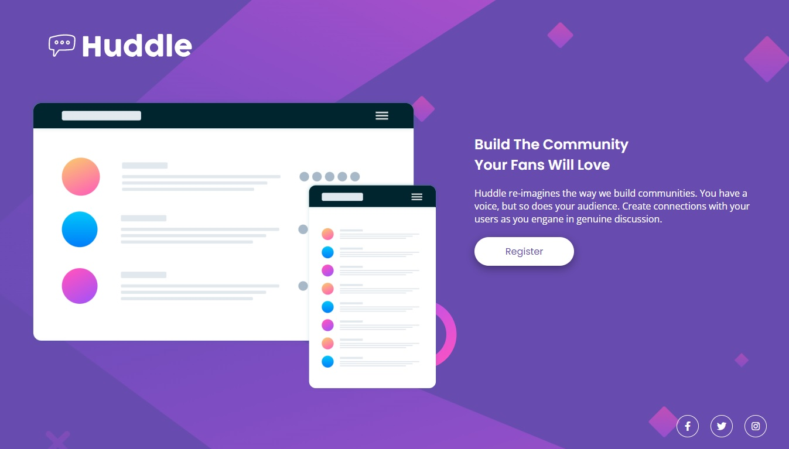

# Quest de HTML & CSS avançados

Primeira quest feita durante o curso DevQuest, dos irmãos Ricardo e Roberto (<a href="https://www.instagram.com/devemdobro" target="_blank">@devemdobro</a>), baseado em um desafio do <a href="https://www.frontendmentor.io/" target="_blank">Frontend Mentor</a>.

## Screenshots

### Desktop

### Mobile

## Tecnologias utilizadas

- HTML
- CSS

## Desafios

O maior desafio foi a utilização do Grid, que ainda é um assunto novo pra mim.

## Coisas que aprendi

- Posicionar elementos utilizando grid e flexbox;
- Trabalhar com variáveis no CSS;
- Fazer um site responsivo.

## Futuro do projeto

- Melhorar a semântica do HTML;
- Refatorar o código.
